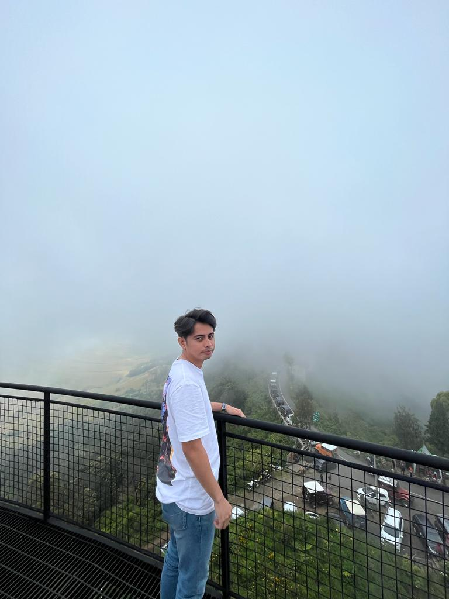

# Henci Miru Profile

## My Bio

Hi, I'm Henci Miru, Revou FSSE Student.



I was born on 12 October, 1998, and grew up in Lelang, Maluku. I'm a Fresh Graduate. I got my bachelor's Degree in Law Department at Universitas Dr. Soetomo, Surabaya . Now i'am currently studying at Revou FSSE Bootcamp. I have a career plan to be a Full Stack Developer in the future. All right, that's from me. Nice to meet you all. Thank you.

## My Hobby

1. **Gaming**
2. **Eating**
3. **Traveling**

## My Links

- Instagram: [@hencimiru](https://instagram.com/hencimiru)
- Github: [@hencimiru](https://github.com/Hencimiru)
- Linkedin: [@hencimiru](https://www.linkedin.com/in/hencimiru/)

## My Favourite Website

| Name    | Url                                 |
| ------- | ----------------------------------- |
| Google  | [Google.com](https://google.com/)   |
| Youtube | [Youtube.com](https://youtube.com/) |

## My Code Examples

### Markdown

```markdown
# Hello World

## Hello World

_This is italic text_
This is a paragraph
```

### HTML

```Html
<html>
    <head>
        <title>Henci Bio</title>
    </head>
        <body>
        <h1>Hello World</h1>
        <p>This is a Paragraph</p>
        </body>
</html>
```

### CSS

```
.container{
    padding: 40px 0;
}
.header-text h1{
    font-size: 50px;
    margin-top: 20px;
}
```

### Javascript

```
event.currentTarget.classList.add("active-link");
            document.getElementById(tabname).classList.add("active-tab");
```
